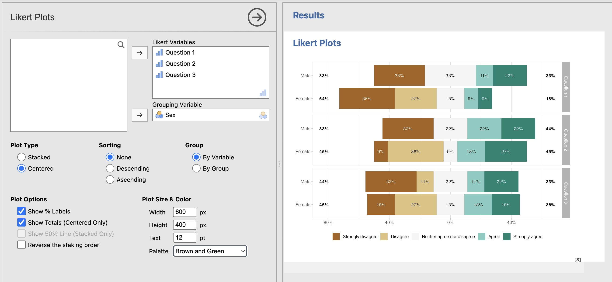

# vijLikert

[jamovi](https://www.jamovi.org) module to generate bar plots for Likert scale variables 
using [ggstats](https://larmarange.github.io/ggstats/) R package by Joseph Larmarange. 
The module is available in the  Exploration Menu. 

## Version history

### 20241008 / 0.2.3 (beta)
- Improve french translation
- Add (this) readme with version history

### 20241007 / 0.2.2 (beta)
- Add french translation

### 20241006 / 0.2.1 (beta)
- First public release